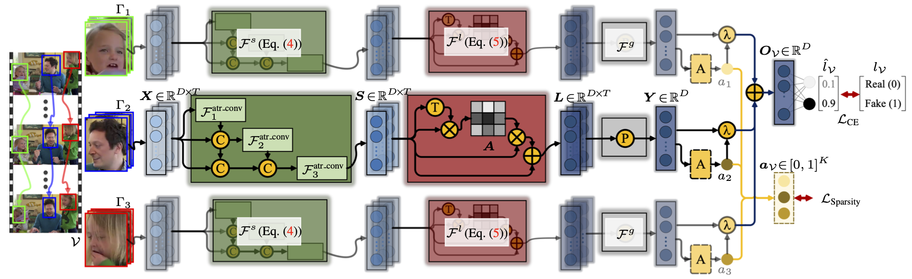
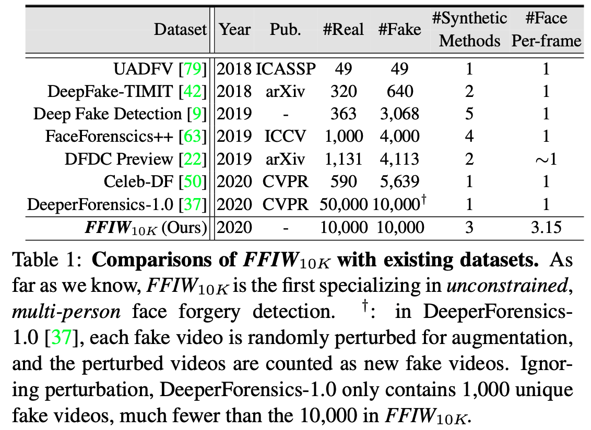

# Face Forensics in the Wild

This repository provides resources for the following paper:

> [**Face Forensics in the Wild**](https://arxiv.org/abs/2103.04570),            
> [Tianfei Zhou](https://www.tfzhou.com/), [Wenguan Wang](https://sites.google.com/view/wenguanwang/), Zhiyuan Liang and [Jianbing Shen](https://scholar.google.ae/citations?user=_Q3NTToAAAAJ&hl=en) <br>
> *CVPR 2021 (Oral)*  


## Abstract
On existing public benchmarks, face forgery detection techniques have achieved great success. However, when used in multi-person videos, which often contain many peo- ple active in the scene with only a small subset having been manipulated, their performance remains far from being satisfactory. To take face forgery detection to a new level, we construct a novel large-scale dataset, called FFIW10K, which comprises 10,000 high-quality forgery videos, with an average of three human faces in each frame. The manipulation procedure is fully automatic, controlled by a domain-adversarial quality assessment network, making our dataset highly scalable with low human cost. In addition, we propose a novel algorithm to tackle the task of multi-person face forgery detection. Supervised by only video-level label, the algorithm explores multiple instance learning and learns to automatically attend to tam- pered faces. Our algorithm outperforms representative approaches for both forgery classification and localization on FFIW10K, and also shows high generalization ability on existing benchmarks. We hope that our dataset and study will help the community to explore this new field in more depth.



## Dataset Download

To download FFIW10K, please fill out the [`Terms to Use` form](https://forms.gle/optbPBocH8UEndwW9) (if you have an educational email account, i.e., *.edu*, please use it). The download link will be sent to you once your request is approved. If you are unable to access the form or have any other questions, please contact us by sending an email to ffiwdataset@gmail.com.

## Dataset Structure
```
FFIW10K
|--- source
     |--- train
     |--- val
|--- target 
     |--- train
     |--- val
|--- target_mask
     |--- train
     |--- val
```

## Comparison with Other Datasets
<p align="left">
  
</p>

## Video Visualization

real                       |  fake
:-------------------------:|:-------------------------:
  |  

## Citation
If you find this work useful for your research, please cite our papers:
```
@InProceedings{Zhou_2021_CVPR,
    author    = {Zhou, Tianfei and Wang, Wenguan and Liang, Zhiyuan and Shen, Jianbing},
    title     = {Face Forensics in the Wild},
    booktitle = {Proceedings of the IEEE/CVF Conference on Computer Vision and Pattern Recognition (CVPR)},
    month     = {June},
    year      = {2021},
    pages     = {5778-5788}
}
```
